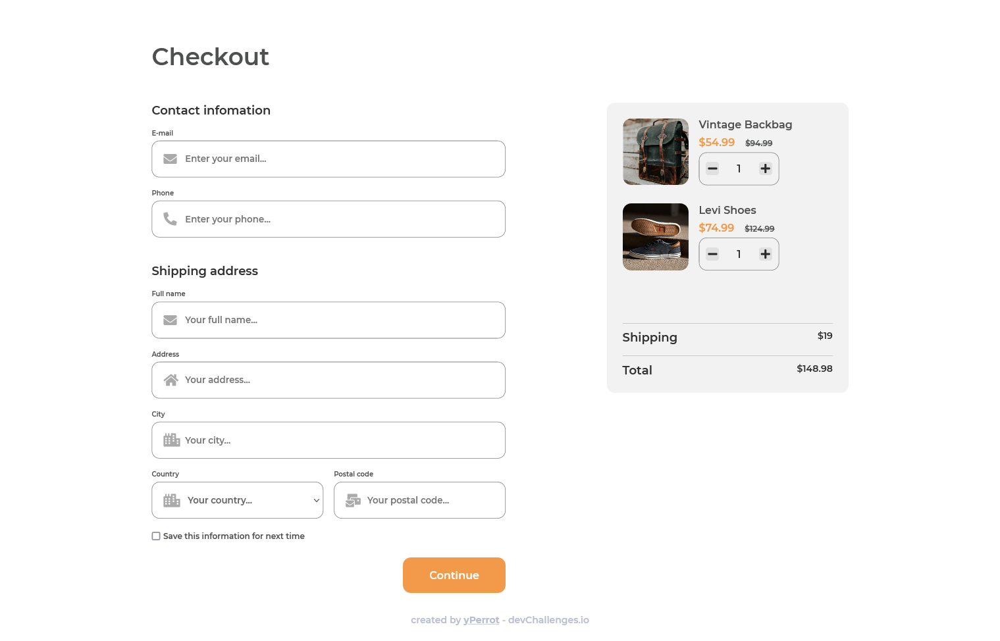

<h1 align="center">Checkout page</h1>

   Solution for a challenge from  <a href="http://devchallenges.io" target="_blank">Devchallenges.io</a>.

## Table of Contents

- [Overview](#overview)
  - [Built With](#built-with)
- [Features](#features)
- [Acknowledgements](#acknowledgements)

<!-- OVERVIEW -->

## Overview

### Built With

 - HTML
 - SCSS
 - JavaScript

## Features

This application/site was created as a submission to a [DevChallenges](https://devchallenges.io/challenges) challenge. The [challenge](https://devchallenges.io/challenges/0J1NxxGhOUYVqihwegfO) was to build an application to complete the given user stories.

## Acknowledgements

- [Round numbers to 2 decimal](https://learnersbucket.com/examples/javascript/learn-how-to-round-to-2-decimal-places-in-javascript/)
- [Add icon in input](https://codepen.io/jamesbarnett/pen/aBnbL)
- [Placeholder for select tag](https://www.w3docs.com/snippets/css/how-to-create-a-placeholder-for-an-html5-select-box-by-using-only-html-and-css.html)
