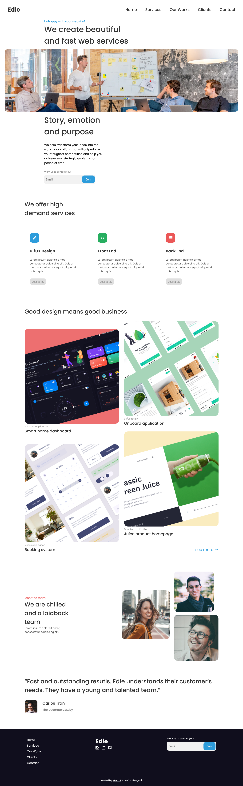

<h1 align="center">Edie Homepage</h1>

   Solution for a challenge from  <a href="http://devchallenges.io" target="_blank">Devchallenges.io</a>.

## Table of Contents

- [Overview](#overview)
  - [Built With](#built-with)
- [Features](#features)
- [Acknowledgements](#acknowledgements)

## Overview

### Built With

 - HTML
 - SCSS
 - JavaScript

## Features

This application/site was created as a submission to a [DevChallenges](https://devchallenges.io/challenges) challenge. The [challenge](https://devchallenges.io/challenges/xobQBuf8zWWmiYMIAZe0) was to build an application to complete the given user stories.

## Acknowledgements

- [Button iside inpute](https://stackoverflow.com/questions/15314407/how-to-add-button-inside-input)
- [Smooth scroll](https://www.w3schools.com/howto/howto_css_smooth_scroll.asp#section2)
