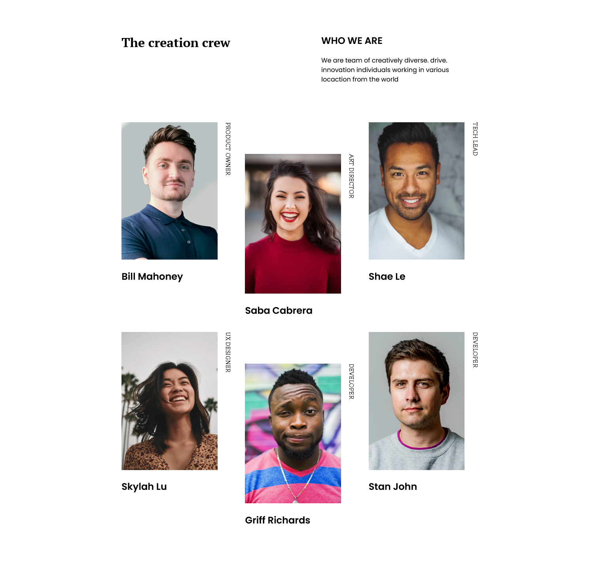
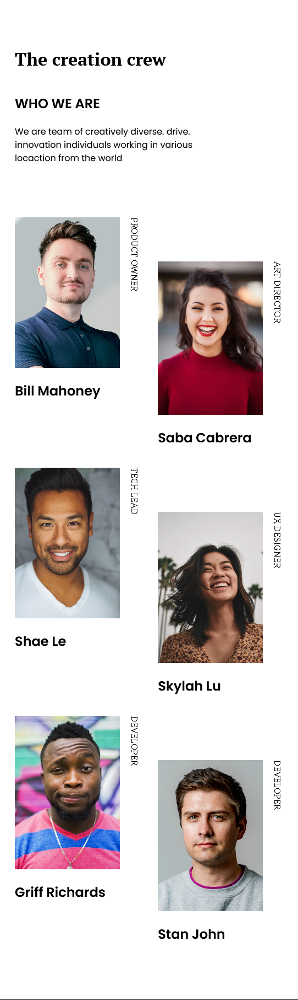

<!-- Please update value in the {}  -->

<h1 align="center">My Team Page</h1>

   Solution for a challenge from  <a href="http://devchallenges.io" target="_blank">Devchallenges.io</a>.

  <h3>
    <a href="https://www.figma.com/file/F8d1qJsorEdY47N74HLxQ4/team-page-challenge">
      Figma
    </a>
     | 
    <a href="https://github.com/yPerrot/devChallenge_My-Team-Page.git">
      Solution
    </a>
     | 
    <a href="https://devchallenges.io/challenges/hhmesazsqgKXrTkYkt0U">
      Challenge
    </a>
  </h3>

## Features

<!-- List the features of your application or follow the template. Don't share the figma file here :) -->

This application/site was created as a submission to a [DevChallenges](https://devchallenges.io/challenges) challenge. The [challenge](https://devchallenges.io/challenges/hhmesazsqgKXrTkYkt0U) was to build an application to complete the given user stories.

## Result

Here is my production.

### PC

### Mobile

## Acknowledgements

<!-- This section should list any articles or add-ons/plugins that helps you to complete the project. This is optional but it will help you in the future. For exmpale -->

- [Grid](https://css-tricks.com/snippets/css/complete-guide-grid/)
- [:nth-child](https://developer.mozilla.org/en-US/docs/Web/CSS/:nth-child)
- [vertical text](https://code-boxx.com/vertical-text-css/)

