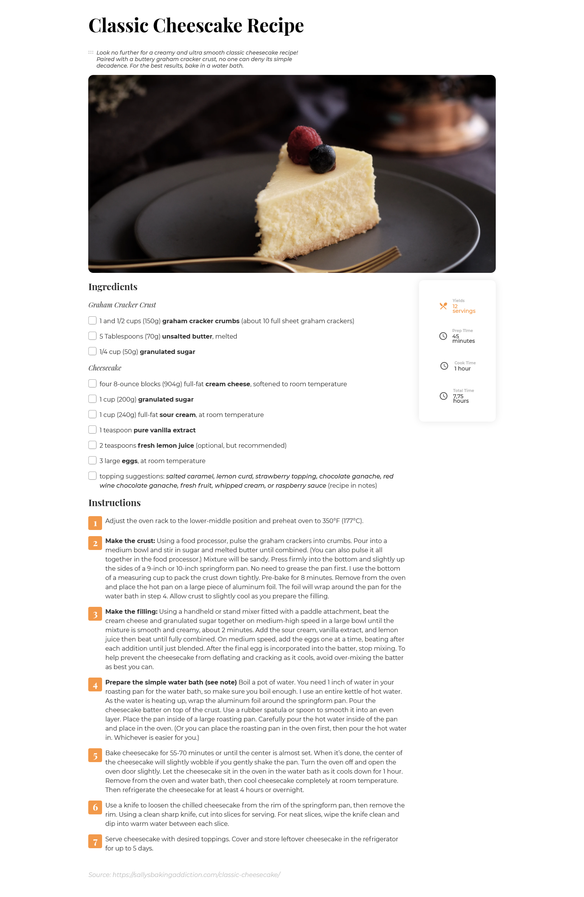

<!-- Please update value in the {}  -->

<h1 align="center">Recipe page</h1>

   Solution for a challenge from  <a href="http://devchallenges.io" target="_blank">Devchallenges.io</a>.

## Table of Contents

- [Overview](#overview)
  - [Built With](#built-with)
- [Features](#features)
- [Acknowledgements](#acknowledgements)

## Overview

### Built With

 - HTML
 - SASS

## Features

This application/site was created as a submission to a [DevChallenges](https://devchallenges.io/challenges) challenge. The [challenge](https://devchallenges.io/challenges/TtUjDt19eIHxNQ4n5jps) was to build an application to complete the following user stories:

## Acknowledgements

- [Flexbox](https://css-tricks.com/snippets/css/a-guide-to-flexbox/)
- [Grid](https://css-tricks.com/snippets/css/complete-guide-grid/)
